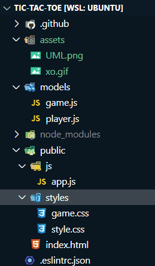
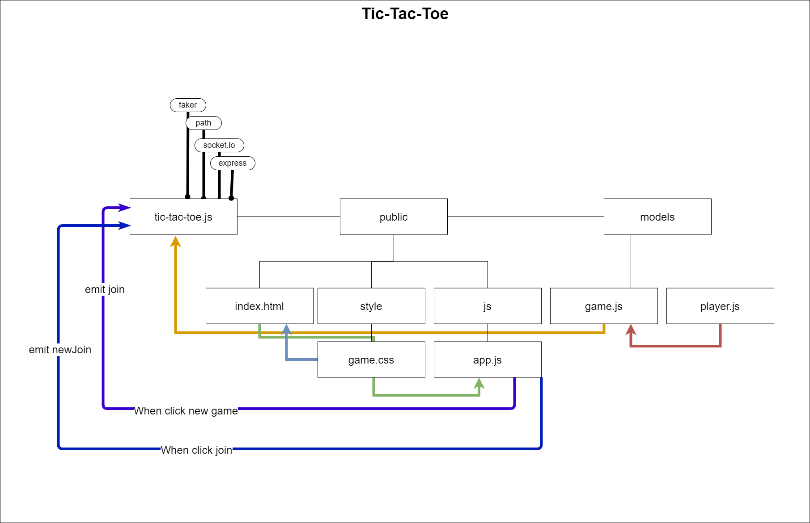

# Tic Tac Toe

## Index

- [socket.io](#socket.io)
- [Tic-tac-toe](#Tic-tac-toe)
- [The app tree](#The-app-tree)
- [More about the app](#More-about-the-app)
  - [Authors](#Author)
  - [Tools](#Tools)
  - [Github](#Github)
  - [UML](#UML)
- [Authors Links](#Authors-Links)

---

# socket.io

- Socket.IO enables real-time bidirectional event-based communication. It works on every platform, browser or device, focusing equally on reliability and speed. Socket.IO is built on top of the WebSockets API (Client side) and Node.js. It is one of the most depended upon library on npm (Node Package Manager).
- Socket.IO is a JavaScript library for real-time web applications. It enables real-time, bi-directional communication between web clients and servers. It has two parts: a client-side library that runs in the browser, and a server-side library for node.js. Both components have an identical API.
- Writing a real-time application with popular web applications stacks like LAMP (PHP) has traditionally been very hard. It involves polling the server for changes, keeping track of timestamps, and it is a lot slower than it should be.
- Sockets have traditionally been the solution around which most real-time systems are architected, providing a bi-directional communication channel between a client and a server. This means that the server can push messages to clients. Whenever an event occurs, the idea is that the server will get it and push it to the concerned connected clients.
- Socket.IO is quite popular, it is used by Microsoft Office, Yammer, Zendesk, Trello, and numerous other organizations to build robust real-time systems. It one of the most powerful JavaScript frameworks on GitHub, and most depended-upon NPM (Node Package Manager) module. Socket.IO also has a huge community, which means finding help is quite easy.
- > for further information, please clicks [here](https://en.wikipedia.org/wiki/WebSocket) or [here](https://www.tutorialspoint.com/socket.io/socket.io_overview.htm)

**[⬆ Back to Index](#index)**

# Tic-tac-toe

- Tic-tac-toe (American English), noughts and crosses (Commonwealth English and British English), or Xs and Os/“X’y O’sies” (Ireland), is a paper-and-pencil game for two players, X and O, who take turns marking the spaces in a 3×3 grid. The player who succeeds in placing three of their marks in a diagonal, horizontal, or vertical row is the winner. It is a solved game with a forced draw assuming best play from both players.
- In order to win the game, a player must place three of their marks in a horizontal, vertical, or diagonal row. The following example game is won by the first player, X:
  - 
- Because of the simplicity of tic-tac-toe, it is often used as a pedagogical tool for teaching the concepts of good sportsmanship and the branch of artificial intelligence that deals with the searching of game trees. It is straightforward to write a computer program to play tic-tac-toe perfectly or to enumerate the 765 essentially different positions (the state space complexity) or the 26,830 possible games up to rotations and reflections (the game tree complexity) on this space. If played optimally by both players, the game always ends in a draw, making tic-tac-toe a futile game.
- The game can be generalized to an m,n,k-game in which two players alternate placing stones of their own color on an m×n board, with the goal of getting k of their own color in a row. Tic-tac-toe is the (3,3,3)-game. Harary's generalized tic-tac-toe is an even broader generalization of tic-tac-toe. It can also be generalized as a nd game. Tic-tac-toe is the game where n equals 3 and d equals 2. It can be generalized even further by playing on an arbitrary incidence structure, where rows are lines and cells are points. Tic-tac-toe is the game given by the incidence structure shown to the right, consisting of nine points, three horizontal lines, three vertical lines, and two diagonal lines, each line consisting of at least three points.

- > for further information, please clicks [here](https://en.wikipedia.org/wiki/Tic-tac-toe)

**[⬆ Back to Index](#index)**

#### **The app tree**

- 

**[⬆ Back to Index](#index)**

### **More about the app**

- #### Authors

  - Mostafa Jdeitawi
  - Shady Khaled
  - Tamara Alrashed
  - Anwar Shraideh

  **[⬆ Back to Index](#index)**

- #### Tools

  - This app build basically by:
    - socket.io
    - Node.js
    - HTML5
    - CSS
    - jQuery

  **[⬆ Back to Index](#index)**

- #### Github

  - For the repo ***tic-tac-toe*** clicks => [here](https://github.com/jdeitawimostafa/tic-tac-toe).

**[⬆ Back to Index](#index)**

- #### UML

  - 

**[⬆ Back to Index](#index)**

- #### App

  - run `npm install`
  - run `node tic-tac-toe.js` or `npm start`
  - visit heroku link [here](https://tic-tic-toe.herokuapp.com/)

- this app done with help of
  - dependencies
    - dotenv
    - express
    - socket.io
    - faker
  - devDependencies
    - nodemon
  - framework
    - Node.js
  - tools
    - Github.
    - VsCode.
    - Ubuntu.
    - Heroku

**[⬆ Back to Index](#index)**

 

---
 

## Authors Links

- ### Shady Khaled github ✅

  - [Shady Khaled](https://github.com/shadykh)

- ### Mostafa Jdeitawi github ✅

  - [Mostafa Jdeitawi](https://github.com/jdeitawimostafa)

- ### Tamara Alrashed github ✅

  - [Tamara Alrashed](https://github.com/Tamaraalrashed)

- ### Anwar Shraideh github ✅

  - [Anwar Shraideh](https://github.com/anwarshraideh)
